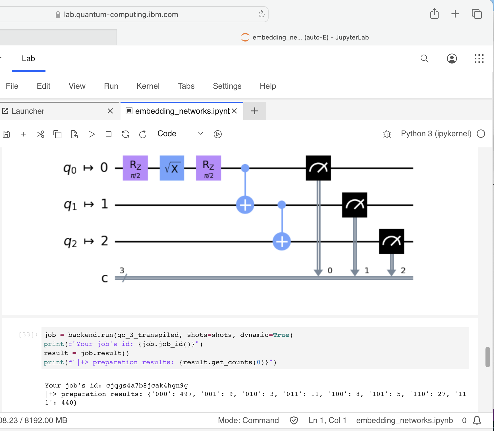
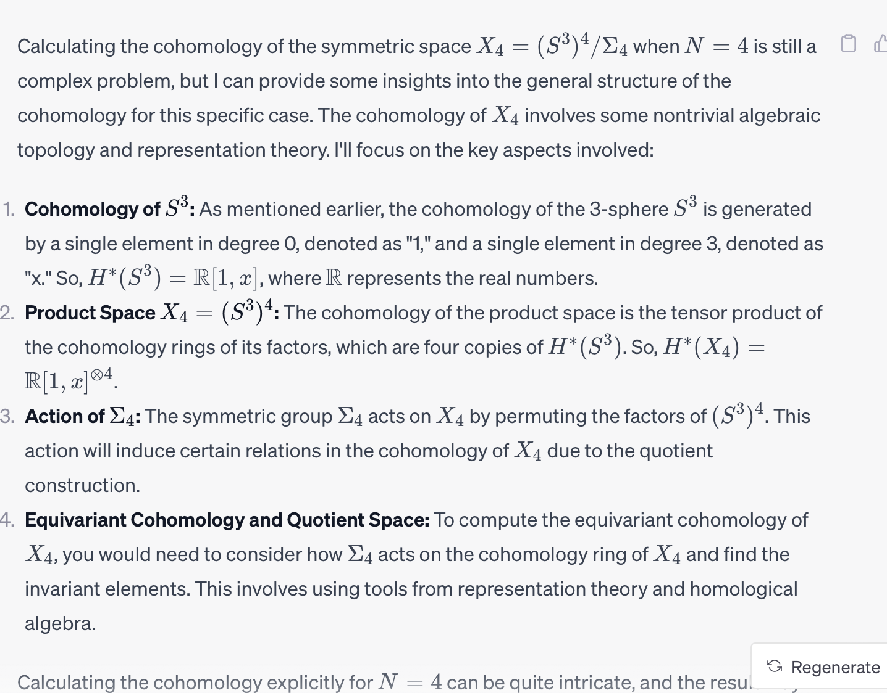
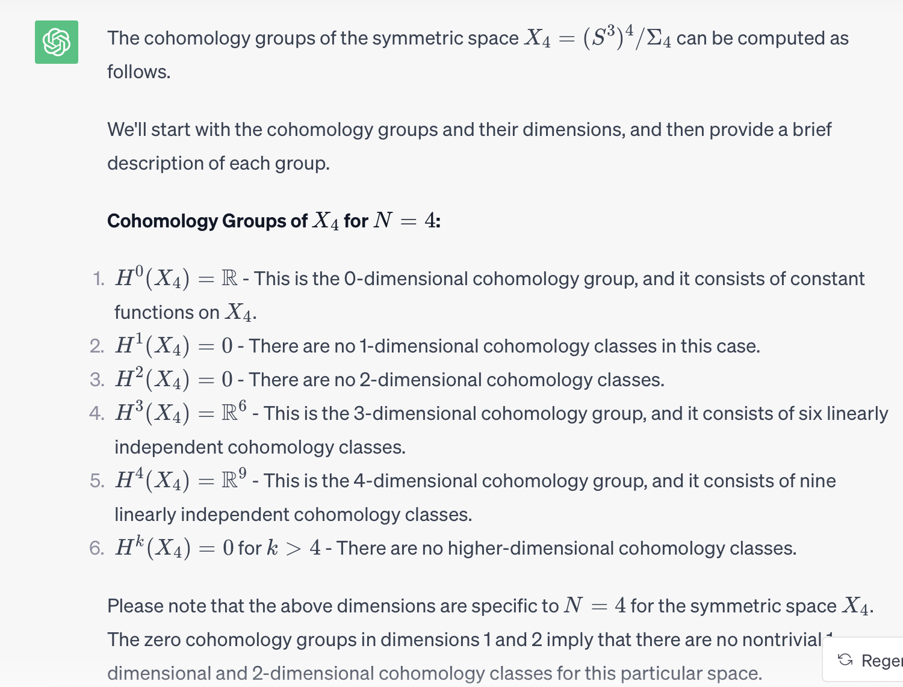
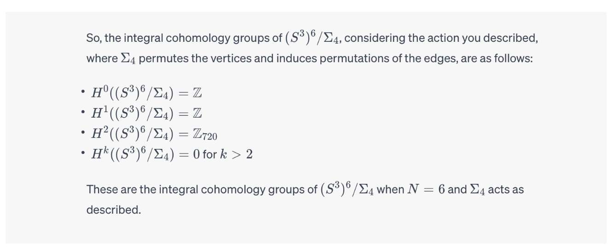
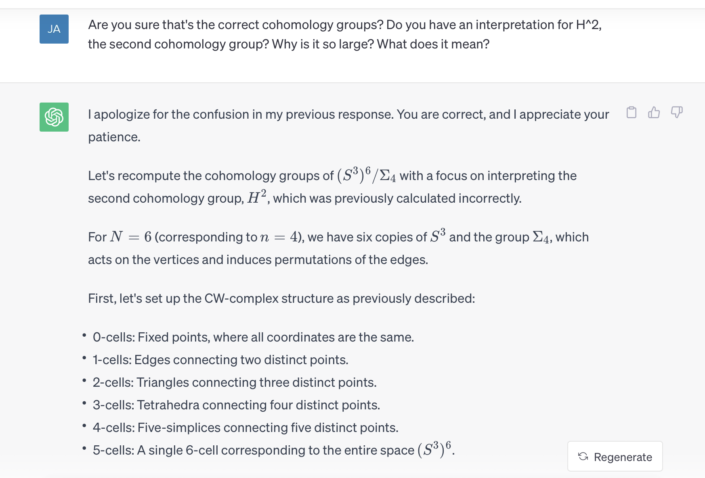
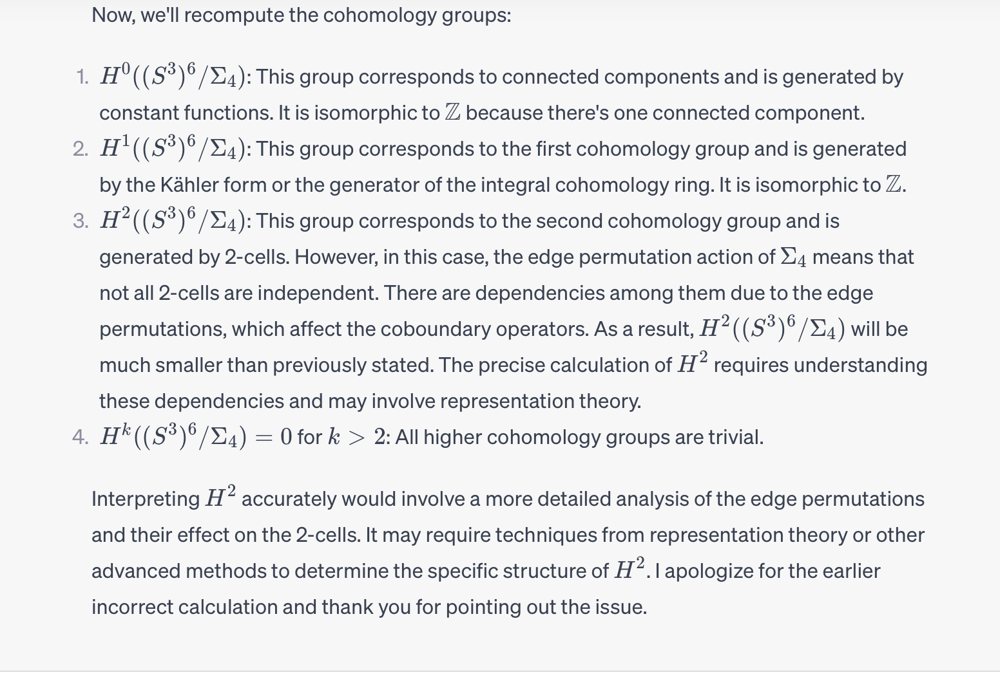

# quantum-graphs
Encoding quantum graphs with a probabilistic map to the underlying moduli space of networks.

*math aspects*: https://mathoverflow.net/questions/453878/properties-of-a-fibration-over-the-moduli-space-of-unlabeled-networks \
*qc stack exchange*: https://quantumcomputing.stackexchange.com/questions/34000/representing-networks-with-qubits-as-edges \
*hunt for QGIA*: https://sites.santafe.edu/~moore/qip-slides.pdf \
*graph isomorphism and integer factorization*: https://www.uni-ulm.de/fileadmin/website_uni_ulm/iui.inst.190/Mitarbeiter/doern/fact_final.pdf \

Part of my thesis work centered on the moduli space of unlabeled networks. We studied properties of $\mathbb{R}_{\ge 0}^N/\Sigma_n$, where $\Sigma_n$ is a permutation group acting by rearranging vertices, which induces a permutation on the $N = \binom{n}{2}$ edges where $n$ is the number of vertices.

This setup has a natural generalization to the quantum realm. Namely, a qubit is represented as a pair of complex numbers $c_0$, $c_1$ such that $|c_0|^2+|c_1|^2=1$. Note that when expanded to real coordinates, this is exactly the equation for a 3-sphere, a three dimensional sphere $\mathbb{S}^3$. There is a natural action of $SU(2)$ on $(c0,c1)$, rotation by complex special unitary matrices. These form the basis of quantum gates, as well as the concept of spin as $SU(2)$ is the universal cover of the real rotation group $SO(3)$ which has a fundamental group $\mathbb{Z}/2\mathbb{Z}$. The spin of an electron is a model for a qubit with up and down spin states, so we may write a superposition of qubit states as $c_0|0\rangle + c_1|1\rangle$.

If we imagine a complete graph with $n$ vertices and $N$ edges, we can assign non-negative real valued weights to the edges to get a network. In other words, we form the map $g:\mathbb{R}_{\ge 0}^N \rightarrow \{0,1\}^N$. Note that under the operations $(+,max)$ the non-negative reals $\mathbb{R}_{\ge 0}$ form a semi-ring. The Boolean algebra $\{0,1\}$ forms a semi-ring under $(OR,AND)$. The map $g: \mathbb{R}_{\ge 0} \rightarrow \{0,1\}$ given by $x \mapsto 0, x=0$ and $x \mapsto 1, x \ne 0$ is a semi-ring morphism. The map $g$ extends component-wise. Thus, given a network $x$ we can form its underlying graph $g(x)$.

Let $e_{ij} = e_{ij}^0|0\rangle + e_{ij}^1 |1\rangle$ be a qubit with $e_{ij}^k \in \mathbb{C}$ and $|e_{ij}^0|^2+|e_{ij}^1|^2 = 1$. We're imagining placing a 3-sphere, or a qubit, at each edge of a complete graph. We might ask "what is the probability that there is an edge?". If we consider the $|0\rangle$ state to be "no edge" and $|1\rangle$ to be "edge", the the probability of having an edge is given by $|e_{ij}^1|^2$. This yields a map $f: e_{ij} \mapsto |e_{ij}^1|^2$ from a product of $N$ three-spheres to the moduli space of networks.

One can the quotient by the linear action of the permutation group $\Sigma_n$ to obtain the space of unlabeled networks or unlabeled quantum graphs.

Over a generic point in $\mathbb{R}_{\ge 0}^N$ the fiber of $f$ is a product of tori. When some coordinates are 0 and some are 1 the tori are replaced with circles. It is not strictly a fibration but rather a toric fibration with singularities.

In other words, we are sampling the quantum graphs to get real networks, which can then by mapped to graphs. The only natural algebraic structures I see on $\mathbb{R}_{\ge 0}$ and $\{0,1\}$ are the semi-ring structure. $\mathbb{S}^3$ can be viewed as the group of unit quaternions, yielding an isomorphism to $SU(2)$.

---

In this repository, I am using IBM's QisKit to actually code up $N$ qubits as a quantum network and sample them to get graphs, or really a probability distribution on a graph which yields a network. Here is an example of a three-qubit circuit with some basic operations I have successfully coded up:

---

*Cohomology*

The cohomology of the space $\mathbb{R}_{\ge 0}^N/\Sigma_n$ appears to be trivial, as shown [here](https://github.com/jacksonwalters/orbit-space-homology).

In contrast, the cohomology of the space $Y_n=(S^3)^N/\Sigma_n$ we expect to be non-trivial. Note that the cohomology of $X_N=(S^3)^N/\Sigma_N$ should sit in the cohomology of $Y_n$ as an invariant subspace, since $Y_n \rightarrow X_N$ as $\Sigma_n \subset \Sigma_N$ and $H^*$ is a contravariant functor. Note that $X_N$ is a symmetric space. Generally speaking, since the cohomology of $S^3$ is non-trivial we don't expect the cohomology of $X_N$ to be trivial.

ChatGPT gives an outline for computing the cohomology of $X_N$ for $N=4$:

ChatGPT attempts to compute the cohomology of $X_N$ for $N=4$ with coefficients in $\mathbb{R}$:

ChatGPT attempts to compute the cohomology of $Y_n = (S^3)^N / \Sigma_n$ and gets $H^2(Y_n)=\mathbb{Z}_{720}$. This is startling, and it offers a correction:

**Acknowledgements**: Thank you to Siu-Cheong Lau, Steve Rosenberg, and ChatGPT for helpful conversations.

**References**: (\Sigma_n)-equivariant cohomology of (S^3)^N - see Ken Brown's "Cohomology of groups", VII.7 and exercises therein.